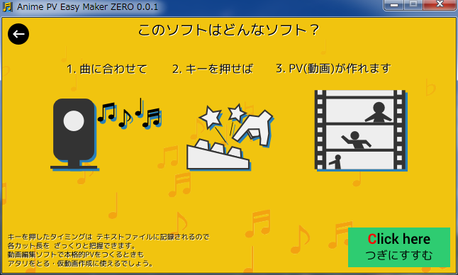
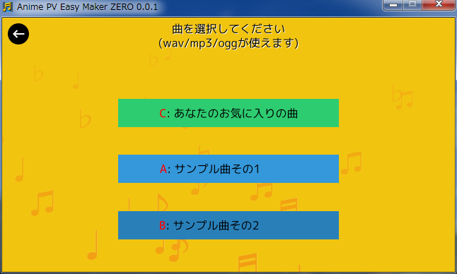
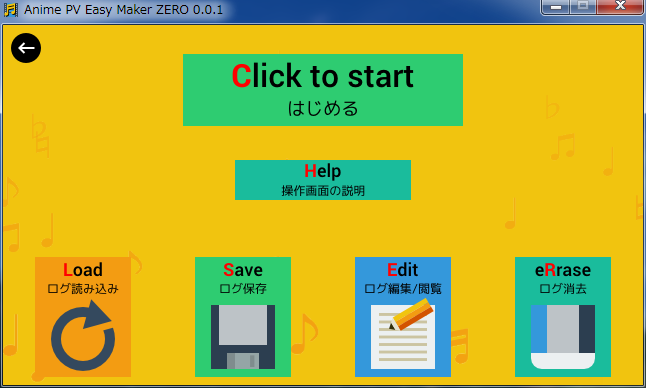
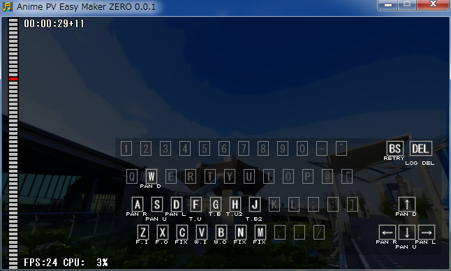
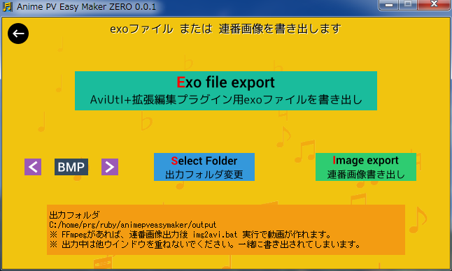

Title: スクリーンショット・チュートリアル
CSS: style.css

スクリーンショット / チュートリアル
===================================

- - - -

{toc}

- - - -

画面の紹介と、チュートリアル
----------------------------

タイトル画面です。起動するとこの画面になります。

「はじめる」ボタンを押してみましょう。次の画面に進むはずです。

* **各ボタンの赤い文字は、ショートカットキーです。**
  * 例えばこの画面では、「Cキー」を押しても次の画面に進みます。
* **ESCキーを押すとソフトを終了できます。**
  * もちろん、ウインドウ右上の閉じるボタンでも、終了できます。
* 右下のボタンを押せば、設定画面に進みます。

- - - -

ソフトの説明画面に切り替わりました。

「つぎにすすむ」ボタンを押してみましょう。

* 左上にある黒い丸ボタンは「戻る」ボタンです。
  * 押すと前の画面に戻ります。
  * **「Backspaceキー」でも戻ることができます。**

- - - -

曲を選択しましょう。

お好みの wav/mp3/ogg ファイルが扱えますが、とりあえず、最初はサンプル曲を選んでみましょう。

* サンプル曲その1は、30秒の曲。
* サンプル曲その2は、1分30秒の曲。(アニメのOP/EDはえてして1分30秒。)

- - - -

画像が入ったフォルダを指定しましょう。

bmp/jpg/pngファイルが扱えます。とりあえず、最初はサンプル画像を選んでみましょう。

* サンプル画像その1は、実写風画像。
* サンプル画像その2は、アニメ風画像。

- - - -

曲と画像の選択が済むと、メニュー画面になります。

「記録開始」を押してみましょう。

* 一番下には、曲、画像、記録ファイル(ログ)の場所が表示されてます。
  * 場所がおかしかったら、前の画面に戻って選択し直しましょう。

- - - -

記録開始画面になりました。

(念のために)「ログ消去」を押して記録を初期化してから、「はじめる」ボタンを押してみましょう。記録が始まります。

* 「はじめる」ボタンを押せば、記録を開始できます。
* 「Help」ボタンを押せば、操作画面の説明が表示されます。
* 下の4つのボタンで、記録ファイルに対して処理ができます。
  * ログ読み込み : 記録ファイルを読み込み直します。
  * ログ保存 : 現在保持している記録をファイルに書き込みます。
  * ログ編集/閲覧 : 記録ファイルをメモ帳で開きます。閲覧はもちろん、編集・保存後に「ログ読み込み」を選べば修正内容が反映されます。
  * ログ消去 : 記録を初期化できます。

- - - -

カウントダウンが始まって…

- - - -

記録画面になりました。曲が流れ始めるはずです。

* キーボードを押せば絵が変わります。曲に合わせて押してください。
* Backspaceキーで中断できます。(※ 記録はファイル保存されません。)
* Deleteキーを押してる間、記録を消去できます。

曲が終わると、記録がファイル保存されて、前の画面に戻ります。

- - - -

曲が終わって、記録開始画面に戻ってきました。

「戻る」ボタンを押してみましょう。

* ここで再度「はじめる」ボタンを押せば、記録を何度も追加・上書きすることができます。

- - - -

メニュー画面に戻ってきました。

「書き出し」ボタンを押してみましょう。

- - - -

書き出し画面です。

* [AviUtl+拡張編集プラグイン](http://spring-fragrance.mints.ne.jp/aviutl/) 用の exo ファイルを書き出すか、
* もしくは、連番画像を書き出すか、

どちらかを選ぶことができます。

ただ、連番画像の書き出しは、

* 実時間の数倍時間がかかる。
* 書き出し中は他のウインドウを重ねることができない。

といった不便さがあるので、exoファイルを書き出して、AviUtl で動画に変換することをオススメします。

書き出しが終わったら作業終了です。ウインドウを閉じてしまって構いません。お疲れ様でした。

- - - -

動画への変換
------------

書き出した結果を動画に変換する手順は、次のような流れになります。

### exoファイルを書き出した場合は…

1. AviUtl を起動して、拡張編集ウインドウを表示。
    * 拡張編集ウインドウは、「設定」→「拡張編集の設定」を選ぶと開きます。
2. 拡張編集ウインドウの上で右クリックしてメニューを表示。
3. 「オブジェクトファイルから新規作成」を選んで、exoファイルを開く。
4. 拡張編集ウインドウ上の「音声ファイル」(赤い部分)に、まだ何も割り当てられていないので、wav/mp3等を割り当てます。
    * 赤い部分をダブルクリックすると、設定ダイアログが開きます。
    * 「参照ファイル」ボタンを押して、wav/mp3等を選択します。
5. 必要であれば、各カットの長さやタイミング、アニメの仕方を調整します。
6. 動画を出力します。
  * 「ファイル」 → 「AVI出力」で動画にできます。

### 連番画像を書き出した場合は…

連番画像を読み込んで動画にできるソフトならなんでもOKですが、FFmpeg.exe があればバッチファイルを実行するだけで動画に変換できます。img2avi.bat を実行して、「avi」か「mp4」を入力すればOKです。

FFmpeg の入手方法は、[faq.html](./faq.html) を参照してください。

- - - -

他画面の紹介
------------

記録開始画面で「Help」を押すと、この説明画面になります。

- - - -

タイトル画面で右下のボタンを押すと、この設定画面になります。

設定変更後は、プログラムの再起動が必要です。

- - - -

アニメ種類について
------------------

とにかくキーを押してみれば、なんとなく動きが分かるでしょうから、説明の必要はなさそうですが…。一応説明しておきます。

* FIX : 固定表示です。絵を動かさずに表示し続けます。
* F.I : フェードイン。真っ暗な状態から、絵が少しずつ見えてきます。
* F.O : フェードアウト。絵が暗くなっていきます。
* W.I : ホワイトフェードイン。真っ白な状態から、絵が少しずつ見えてきます。
* W.O : ホワイトフェードアウト。絵が白くなっていきます。
* T.U : トラックアップ。絵がゆっくり大きくなります。
* T.B : トラックバック。絵がゆっくり小さくなります。
* T.U2 : 急なトラックアップ。急激に絵が大きくなります。
* T.B2 : 急なトラックバック。急激に絵が小さくなります。
* PAN U : PANアップ。絵の上のほうが見えてきます。(下スクロール)
* PAN D : PANダウン。絵の下のほうが見えてきます。(上スクロール)
* PAN R : PANライト。絵の右のほうが見えてきます。(左スクロール)
* PAN L : PANレフト。絵の左のほうが見えてきます。(右スクロール)

キー割り当てが気に入らない場合は、animekind.csv を書き換えてみてください。

