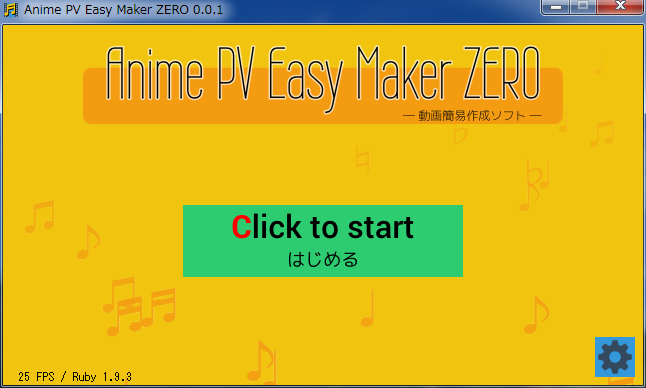

Title: Anime PV Easy Maker ZERO readme
CSS: doc/style.css

Anime PV Easy Maker ZERO
=======================

- - - -

{toc}

- - - -

概要
----

曲に合わせてキーボードを押すだけで、PV(動画)が作れるフリーソフトです。

ソフトの特徴
------------

* ウイザード形式に似た簡単操作。
* サンプル画像/サンプル曲を同梱。すぐに試せます。
* 静止画像を動かしてアニメ・動画にしますので、曲ファイルの他に、写真やイラストを数枚用意するだけで動画を作れます。
* キーを押したタイミングはテキストファイルで記録。本格的動画を作る際のアタリをつける作業にもどうぞ。
* 動画編集ソフト [AviUtl+拡張編集プラグイン](http://spring-fragrance.mints.ne.jp/aviutl/)用の exo ファイルを出力できるので、各カットのアニメの仕方も自由自在。
* 動画変換の元素材として、連番画像を出力できます。
* 動画変換プログラム [FFmpeg](http://www.ffmpeg.org/) があれば、バッチファイルを実行するだけで動画に変換できます。

動作確認OS
-----------

* Windows7 x64
* Windows XP SP3 (32bit)

インストール方法
----------------

ダウンロードしたzipファイルを解凍して、フォルダごとお好きな場所に置いてください。

* Windows Vista/7/8 では、C:\Program Files\ 以外の場所に置くことをおすすめします。ソフトを実行すると設定ファイルを作りますが、C:\Program Files\ 以下はファイル書き込みが自由にできないので、動作しない可能性があります。

アンインストール方法
--------------------

フォルダごと削除してください。レジストリは使っていません。

起動方法
--------

解凍したフォルダの中の、anipvmaker.exe を実行してください。

スクリーンショット・チュートリアル
----------------------------------

[doc/screenshot.html](./doc/screenshot.html) を見てください。

FAQ
---

[doc/faq.html](./doc/faq.html) を見てください。

LICENSE / ライセンス
--------------------

プログラム部分(*.rb)は、DXRubyのサンプルファイル群と同様に、
[Public domain](http://ja.wikipedia.org/wiki/%E3%83%91%E3%83%96%E3%83%AA%E3%83%83%E3%82%AF%E3%83%89%E3%83%A1%E3%82%A4%E3%83%B3)
とします。改造・再配布等、ご自由にどうぞ。

同梱サウンドファイル(*.mp3)のライセンスは、
[CC0](http://sciencecommons.jp/cc0/about)
([Public domain](http://ja.wikipedia.org/wiki/%E3%83%91%E3%83%96%E3%83%AA%E3%83%83%E3%82%AF%E3%83%89%E3%83%A1%E3%82%A4%E3%83%B3) 相当)
とします。自由に使ってください。

- - - -
 
同梱画像(sampledata/image?/*.jpg)のライセンスは、画像提供サイト/ソフトのライセンスを確認してください。以下のサイト/ソフトを利用しています。

* 実写風画像 : [PAKUTASO - WEB制作向けの無料写真素材/商用可](http://www.pakutaso.com/)
* アニメキャラ風画像 : [3Dカスタム少女XP (18禁ソフト)](http://tech3d.sakura.ne.jp/3dcustom/top.html)

- - - -

同梱フォントのライセンス(.ttf , .bdf)は、フォントファイル/画像と一緒にライセンス内容を記述したテキストファイルを同梱してありますので、そちらを参照してください。以下のフォントを利用しています。

* [5x5フォント : 2006-08-14 - 兼雑記](http://d.hatena.ne.jp/shinichiro_h/20060814#1155567183)
* [k12x10 font](http://z.apps.atjp.jp/k12x10/)
* [8×8ドット日本語フォント「美咲フォント」](http://www.geocities.jp/littlimi/misaki.htm)
* [M+ FONTS](http://mplus-fonts.sourceforge.jp/)
* [東雲フォント - /efont/ 電子書体オープンラボ](http://openlab.ring.gr.jp/efont/)

動作確認環境
------------

* Windows7 x64
* CPU : Core i5 2500
* メモリ : 8GB
* ビデオカード(GPU) : NVIDIA 9800GTGE

開発言語・ライブラリ
--------------------

* Ruby 1.9.3 p429 mingw版
  * [RubyInstaller for Windows](http://rubyinstaller.org/)
* DXRuby 1.5.0 dev
  * [Project DXRuby](http://dxruby.sourceforge.jp/)
  * [DXRuby プロジェクトWiki - ファイル置き場](http://dxruby.sourceforge.jp/cgi-bin/hiki.cgi?%A5%D5%A5%A1%A5%A4%A5%EB%C3%D6%A4%AD%BE%EC)
* Ayame/Ruby 0.0.3
  * [DXRuby プロジェクトWiki - ファイル置き場](http://dxruby.sourceforge.jp/cgi-bin/hiki.cgi?%A5%D5%A5%A1%A5%A4%A5%EB%C3%D6%A4%AD%BE%EC)

履歴
----

* ver 0.0.1 (2013/08/04) とりあえず作成。

 